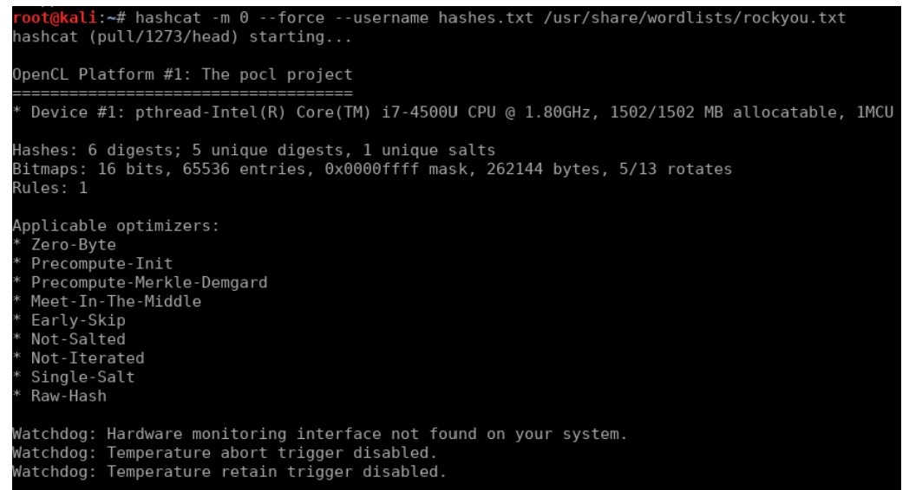
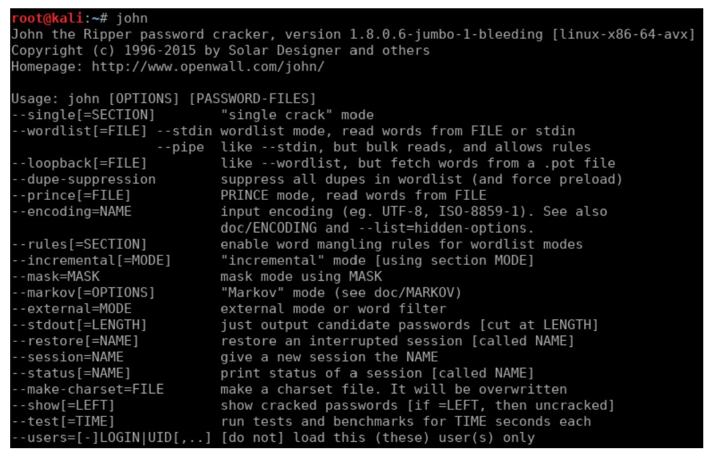

# Password Cracking Lab

## Overview
Demonstrating password hash cracking using **John the Ripper** and **Hashcat**.

## Tools Used
- Kali Linux
- John the Ripper
- Hashcat
- RockYou wordlist

## Steps Taken
1. Created test user accounts with hashed passwords.
2. Extracted `/etc/shadow` hashes.
3. Used wordlist attacks with John the Ripper.
4. Tried brute-force mode in Hashcat.
5. Measured cracking speed & success rates.

## Screenshots
**John The Ripper Screenshot**

**Hashcat screeenshot**

## Results
- Cracked weak passwords in seconds.
- Strong, complex passwords resisted attacks.

## References
- [John the Ripper Docs](imahashcat.jpgges)
- [Hashcat Docs](https://hashcat.net/hashcat/)
